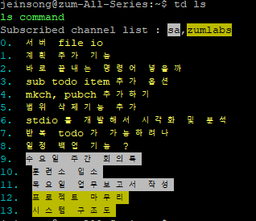

# td-ls 
Simple, Lightweight, Command-line Todo-list & Tech-blogging service for engineers  

# md 업데이트중 

## setting
- prerequisite: node 8+
- multi-user environment & using global node
  ```
  git clone https://github.com/songjein/tdls (추후에 npm에 등록할 예정)
  cd tdls ; npm i
  echo 'export TDLS=<path-to-tdls/cmd>' >> .bashrc
  ```
- single-user environment
  ```
  git clone https://github.com/songjein/tdls
  cd tdls ; sudo npm i -g
  ```
# ↓ Old Version...

## Motivation
커맨드라인 인터페이스 상에서 많은 시간을 보내는 엔지니어를 위한 일정관리(todo-list) 툴입니다.  
반드시 일정(todo)만을 위해 사용하라는 법은 없습니다. 
개발 도중 갑자기 떠오르는 아이디어를 메모할 때도 유용합니다.  
팀원과 공유해야할 일정 혹은 메모가 있다면 채널을 만들고 구독 및 출판 기능을 통해 공유가 가능합니다.



## Features
1. add(추가), ls(조회), rm(삭제), fin(끝내기), co(순서 바꾸기) 기능 지원 
2. todo item 공유를 위한 채널 생성 기능 (mkch)
3. 특정 채널에 todo item 보내기 (pubch)
4. 채널 구독을 통한 일정 받아 보기 (subch -> ls) 
5. md 기반의 블로깅 툴 (계획)
6. 웹 페이지 에서의 데이터 시각화 및 업무 패턴 분석 (계획)

## Installation
1. git clone  https://github.com/songjein/td
2. cd td
3. sudo npm i -g

## Usage
> ## td -h 
>> 지원하는 명령어를 확인할 수 있습니다.
<pre>
  Usage: td [options] [command]

  Options:

    -V, --version  output the version number
    -h, --help     output usage information

  Commands:

    add|a          add todo item
    ls|l           list todo items
    lsf|lf         list finished todo items
    co|c           change order of two items
    fin|f          finish todo item
    rm|r           remove todo item
    mkch|mc        make channel
    lsch|lc        list subscribed channels
    rmch|rc        remove subscribed channel
    subch|sc       subscribe channel
    pubch|pc       publish todo item
    help [cmd]     display help for [cmd]

</pre>

> ## td help 'command'
>> 특정 명령어의 사용법을 확인합니다.
<pre>
  Usage: td-add [options]

  Options:

    -m, --msg <required>   Todo item (message)
    -s, --secret           Secret mode
    -h, --help             output usage information
</pre>

> ## td add -t "첫번째 일정"
<pre>
add command ;  + 첫번째 일정
- Public mode -
Added Successfully
</pre>

> ## td ls 
>> 목록을 조회합니다.
<pre>
ls command
0.  sub todo item 추가 옵션
1.  계획 추가 기능
2.  삭제기능 추가하기
3.  바로 끝내는 명령어 넣을까
4.  서버 file io
5.  첫번째 일정
</pre>

> ## td fin -i 5
>> 인덱스에 해당하는 아이템을 끝냅니다. 기본값은 0입니다.
<pre>
fin command ;  idx : 5
? Finish 5th item '첫번째 일정'? Yes
Finished Successfully
</pre>

> ## td co -1 0 -2 4
>> -1 옵션에 전달된 인덱스의 아이템과 -2 옵션에 전달된 인덱스의 아이템 순서를 바꿉니다. (Change Order), -2 옵션의 기본값은 0입니다. (-1 옵션만 전달 시 최상단으로 순서 변경)
<pre>
co command ;  0  <--->  4
Changed Successfully

0.  서버 file io
1.  계획 추가 기능
2.  삭제기능 추가하기
3.  바로 끝내는 명령어 넣을까
4.  sub todo item 추가 옵션
</pre>

## todo
- 빠른 반응성 위해 서버에 접속할 경우엔 td ls -s 옵션으로 분리
- 웹 인터페이스 
- 디비 연동은 고민, 


- 제가 써보니 매우 편리하고 효율적인 업무 관리를 가능하게하는 툴임이 분명합니다
- 커맨드라인 상에서 작업하는 시간이 많은 분일 수록 꼭 써야합니다
- 안쓰면 바보
